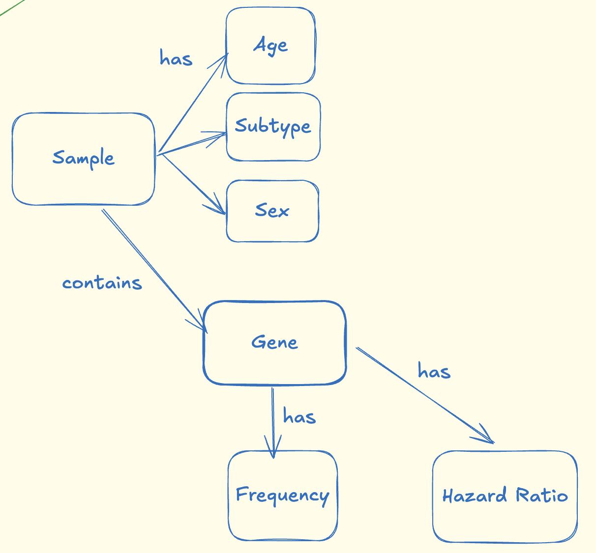

# Cancer_target_KG
Build a knowledge graph integrating cancer genomics data to identify potential biomarkers and therapeutic targets (e.g. TCGA)

# Flowchart

# Brainstorming Knowledge Graph Schema

