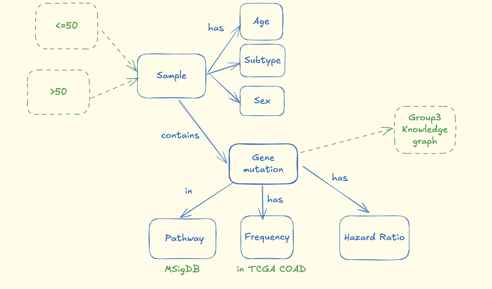

# ECoKG
### A Knowledge Graph for understanding early onset colorectal cancer

## Overview
This project builds a knowledge graph integrating cancer genomics data to identify potential biomarkers and therapeutic targets. We focus on colorectal adenocarcinoma (COAD) because it is well-represented in both TCGA (The Cancer Genome Atlas) and CPTAC (Clinical Proteomic Tumor Analysis Consortium) datasets, enabling cross-platform validation.

## Project Approach
Our analysis strategy involves three key steps:

1. Model Development in TCGA: Build a survival prediction model for colorectal adenocarcinoma using genetic markers from TCGA data
2. Cross-Platform Validation: Test how well the TCGA-derived model performs when applied to CPTAC data
3. Model Enhancement: Expand the model in CPTAC by incorporating both the original genetic markers and CPTAC's proteomic data to assess whether protein-level information improves predictive accuracy

We perform survival analysis stratified by age groups (≤50 vs >50 years old) and report hazard ratios with 95% confidence intervals to identify age-specific biomarkers and therapeutic targets.

## Knowledge Graph Construction
The primary goal of this project is to construct a comprehensive knowledge graph that captures relationships between genes, mutations, proteins, clinical outcomes, and patient characteristics. The repository documents our methodology for determining which entities should be represented as nodes and which relationships should be represented as edges in the graph structure.
Getting Started

See the flowchart and schema diagrams in this repository for a visual overview of the project workflow and knowledge graph design.

# Flowchart

# Brainstorming Knowledge Graph Schema

## Methods
We built a knowledge graph to understand the drivers of colorectal cancer in younger age groups. Our approach integrates genetic markers, proteomic data, clinical outcomes, and patient characteristics to identify and validate potential therapeutic targets while accounting for the demographic and molecular heterogeneity of colorectal cancer.

### Knowledge Graph Schema
The knowledge graph nodes include gene attributes defined by hazard ratio (HR) and mutation frequency, along with a network of pathways to which each gene belongs. Nodes also consist of various clinical metadata including gender, histological subtype, stage, genomic subtype, and age group (≤50 vs >50 years old).

### TCGA Survival Analysis
Age was stratified into two groups (≤50 and >50 years old), and hazard ratios were calculated for each age subtype with respect to gene mutation status via Cox proportional hazards models. Hazard ratios were interpreted as explaining the association of survival with respect to mutation status in younger versus older age groups. HRs were calculated by fitting a Cox proportional hazards model with gene mutation status predicting overall survival. For example, HR > 1 for gene A in the group of samples with age ≤50 indicated that a mutation in gene A was associated with worse prognosis (increased mortality risk).

Genes with mutation frequency lower than 2% were dropped from the analysis set. We were particularly interested in identifying genes that exhibit differing HRs between age groups (≤50 vs >50 years old), as these may represent age-specific therapeutic targets.

### CPTAC Validation and Enhancement
We validated the TCGA-derived survival model in the independent CPTAC cohort using the same Cox proportional hazards modeling approach. Additionally, we constructed an enhanced model in CPTAC that incorporates both genetic markers and proteomic data to assess whether protein-level information improves survival prediction beyond genetic mutations alone.

### Statistical Reporting
We report hazard ratios and 95% confidence intervals for all identified markers. The proportional hazards assumption was tested using standard diagnostics. Survival curves were visualized using Kaplan-Meier plots with separate lines for young versus old age groups. All findings are presented within the knowledge graph framework that captures the complex relationships between genes, proteins, mutations, clinical outcomes, and patient characteristics. All analysis was performed using R statistical software and the tidyverse and survival packages.

# HOW TO RUN THIS PROGRAM

Add code in triple-backticks so that a new user accessing this repo knows what to do with it (e.g., how to I clone the GitHub repo, how to install, requirements/dependencies, example queries, how do I apply it to my own data set, etc.). Check out GeNETwork's repo!!
