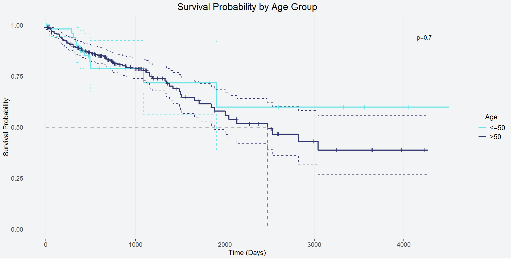

# ECoGraph
### A Knowledge Graph for understanding early onset colorectal cancer

## Overview
This project builds a knowledge graph integrating cancer genomics data to identify potential biomarkers and therapeutic targets. We focus on colorectal adenocarcinoma (COAD) because it is well-represented in both TCGA (The Cancer Genome Atlas) and CPTAC (Clinical Proteomic Tumor Analysis Consortium) datasets, enabling cross-platform validation.

## Project Approach
Our analysis strategy involves three key steps:

1. Model Development in TCGA: Build a survival prediction model for colorectal adenocarcinoma using genetic markers from TCGA data
2. Cross-Platform Validation: Test how well the TCGA-derived model performs when applied to CPTAC data
3. Model Enhancement: Expand the model in CPTAC by incorporating both the original genetic markers and CPTAC's proteomic data to assess whether protein-level information improves predictive accuracy

We perform survival analysis stratified by age groups (≤50 vs >50 years old) and interaction with gene mutated status and report hazard ratios and their corresponding significance to identify age-specific biomarkers and therapeutic targets.

## Knowledge Graph Construction
The primary goal of this project is to construct a comprehensive knowledge graph that captures relationships between genes, mutations, proteins, clinical outcomes, and patient characteristics. The repository documents our methodology for determining which entities should be represented as nodes and which relationships should be represented as edges in the graph structure.
Getting Started

See the flowchart and schema diagrams in this repository for a visual overview of the project workflow and knowledge graph design.

# Flowchart


# Brainstorming Knowledge Graph Schema


## Methods
We built a knowledge graph to understand the drivers of colorectal cancer in younger age groups. Our approach integrates genetic markers, proteomic data, clinical outcomes, and patient characteristics to identify and validate potential therapeutic targets while accounting for the demographic and molecular heterogeneity of colorectal cancer. The data has been downloaded from [GDC](https://gdc.cancer.gov/about-data/publications/pancanatlas) corresponding to pancan TCGA publications 

### Knowledge Graph Schema
The knowledge graph nodes include gene attributes defined by hazard ratio (HR) and mutation frequency, along with a network of pathways to which each gene belongs. Nodes also consist of various clinical metadata including gender, histological subtype, stage, genomic subtype, and age group (≤50 vs >50 years old).

### TCGA Survival Analysis
Age was stratified into two groups (≤50 and >50 years old), and hazard ratios were calculated for each age subtype and its interaction with gene mutation status via Cox proportional hazards models. Hazard ratios were interpreted as explaining the association of survival with respect to mutation status in in older age groups vs WT status of the same gene in younger patients. HRs were calculated by fitting a Cox proportional hazards model with age group (≤50 vs >50 years old) and gene mutation status predicting overall survival. For example, HR > 1 for gene A indicates that >50 age group carrying that mutation showed worse prognosis (increased mortality risk) as compared to those not carrying the mutation in the <=50 age group. 

Genes with mutation frequency lower than 2% were dropped from the analysis set. We were particularly interested in identifying genes that exhibit differing HRs between age groups (≤50 vs >50 years old), as these may represent age-specific therapeutic targets.



### CPTAC Validation and Enhancement
We validated the TCGA-derived survival model in the independent CPTAC cohort using the same Cox proportional hazards modeling approach. Additionally, we constructed an enhanced model in CPTAC that incorporates both genetic markers and proteomic data to assess whether protein-level information improves survival prediction beyond genetic mutations alone.

### Statistical Reporting
We report hazard ratios and 95% confidence intervals for all identified markers. The proportional hazards assumption was tested using standard diagnostics. Survival curves were visualized using Kaplan-Meier plots with separate lines for young versus old age groups. All findings are presented within the knowledge graph framework that captures the complex relationships between genes, proteins, mutations, clinical outcomes, and patient characteristics. All analysis was performed using R statistical software and the tidyverse and survival packages.

# HOW TO RUN THIS PROGRAM

## Quick Start

### Prerequisites

* Conda package manager (your new best friend)
* ~10–15 GB free disk space (yes, cancer data is hefty)

### Environment Setup
We've prepared two conda environments for you. Think of them as "comfort" vs. "precision" modes:

### Option A: Full environment (comfort; recommended for first-timers)
```
conda env create -f scripts/conda_environment_full.yml && conda activate base
```

### Option B: Minimal environment (precision; for the brave and disk-space-conscious)
```
conda env create -f scripts/conda_environment.yml && conda activate base
```

The full environment has every dependency pinned to exact versions—perfect for "but it worked on my machine!" situations. The minimal environment is lighter and gives you more wiggle room with package versions.

### Verify Installation
Let's make sure everything installed correctly (crossing fingers optional):

```
bedtools --version   # ~2.26.0
bcftools --version   # ~1.20
htslib --version     # ~1.20
R --version          # 4.3.x
```

If these commands work, congratulations! You're officially ready to wrangle some genomic data.

### Understanding the Data
All processed data files live in the data/ directory. Here's what you'll find there (and what it all means):

### Main Analysis Files:

```
coad_metadata.csv – Clinical metadata for TCGA colorectal adenocarcinoma (COAD) samples. This is where patient demographics, survival outcomes, and clinical characteristics live.
coad_mut_data.csv – The cleaned, analysis-ready mutation data for COAD samples. Start here for your survival analysis!
coad_mutation_rates.csv – Mutation rate summaries across samples.
coad_subtype_data.csv – Molecular subtype classifications for COAD samples.
```

### Age-Stratified Subsets (because age matters in cancer):

```
younger_subset_coad_mut_data.csv – Mutation data for patients ≤50 years old
younger_subset_coad_mutation_rates.csv – Mutation rates for the younger cohort
older_subset_coad_mut_data.csv – Mutation data for patients >50 years old
older_subset_coad_mutation_rates.csv – Mutation rates for the older cohort
```

### Reference Files:

```
clinically_sig_genes.csv – Genes flagged as clinically significant (spoiler: these are the ones you probably care about)
gene_0.02thr_HR_pval.csv – Genes with hazard ratios and p-values meeting statistical thresholds
human_canonical_pways.csv – Canonical biological pathways for functional enrichment
```

### ClinVar Integration:

```
tcga_clinvar_maf.csv – Intersection of TCGA mutations with ClinVar pathogenic variants
```

### Reference Files For AWS Neptune Knowledge Graph:

```
\faLongArrowAltRight edges_has_gene_part001.csv     # Edge Tumor Sample -- Gene
\faLongArrowAltRight edges_has_subtype.csv          # Edge Tumor Sample -- Tumor Subtype
\faLongArrowAltRight edges_in_pathway.csv           # Edge Gene -- Pathway
\faLongArrowAltRight edges_is_of_age.csv            # Edge Tumor Sample -- Age
\faCircle vertices_age.csv               # Vertex Age
\faCircle vertices_gene.csv              # Vertex Gene
\faCircle vertices_sample.csv            # Vertex Sample
\faCircle vertices_subtype.csv           # Vertex Tumor Subtype
```

### Supplementary Files:

```
TCGA-CDR-SupplementalTableS1.xlsx – TCGA Clinical Data Resource table
TCGASubtype.20170308.tsv – TCGA PanCanAtlas subtype classifications
data_cleaning.R – The R script that transformed raw data into the clean files above (peek inside if you're curious about our methods!)
```

### Running the Analysis
With your environment activated and data files ready to go, you're all set! The main analysis workflow starts with the cleaned COAD mutation and metadata files. Check out `tcga_survival_analysis_pseudocode.R` for guidance on the survival analysis pipeline, which will:

1. Merge mutation data with clinical metadata
2. Stratify patients by age (≤50 vs. >50 years)
3. Run Cox proportional hazards models
4. Generate those beautiful Kaplan-Meier curves we all love

For knowledge graph construction and further analyses, consult the individual script documentation.

### Notes for the Road

- **Cloud deployment:** This pipeline plays nicely with Amazon Linux and Conda. All the bioinformatics tools (bcftools, bedtools, htslib, tabix) come bundled in the conda environment—no hunting for dependencies required!
- **Storage:** Keep ~10–15 GB free during analysis runs. Your hard drive will thank you.
- **Questions?** The data files are pre-processed and ready for analysis using the GRCh37 reference genome. If something seems off, check the commit messages in the repo—we've been busy debugging and refining!

Now go forth and discover some biomarkers! 🧬


# Repository Structure
## Key Directories
* **Root directory** – Documentation, workflow diagrams, and the survival analysis pseudocode template.
* **data/** – All the good stuff! Pre-processed TCGA colorectal cancer data, age-stratified subsets, reference gene lists, and pathway annotations. This is where the magic happens.
* **scripts/** – Environment configurations and data processing pipeline scripts. Start with the conda environment files to set up your workspace.

```
Cancer_target_KG/
│
├── README.md                              # You are here!
├── LICENSE                                # MIT License
├── initial_flow_chart.png                 # Project workflow overview
├── draft_knowledge_graph_scheme.png       # KG schema diagram
│
├── scripts/                               # Analysis and pipeline scripts
│   ├── conda_environment.yml              # Minimal conda environment
│   ├── conda_environment_full.yml         # Full pinned environment (recommended)
│   ├── 1.generate_mc3_bed.sh              # MAF → BED conversion
│   ├── 2.clinvar_pos_in_mc3_allvcf.sh     # ClinVar/MC3 intersection
│   ├── 3.filter_crc_from_clinvar_mc3.sh   # CRC variant filtering
│   ├── 4.filter_by_rsid_pathogenic.sh     # Pathogenic variant filter
│   └── 5.annotate_allele_match.sh         # Allele match annotation
│   └── 6.survival-kg.ipynb                # Ipython notebook to build the Knowledge Graph
│
├── data/                                  # Processed TCGA & reference data
│   ├── neptune_csv/                       # Amazon Neptune Knowledge Graph formatted files
│   │   ├── edges_has_gene_part001.csv     # Edge Tumor Sample -- Gene
│   │   ├── edges_has_subtype.csv          # Edge Tumor Sample -- Tumor Subtype
│   │   ├── edges_in_pathway.csv           # Edge Gene -- Pathway
│   │   ├── edges_is_of_age.csv            # Edge Tumor Sample -- Age
│   │   ├── vertices_age.csv               # Vertex Age
│   │   ├── vertices_gene.csv              # Vertex Gene
│   │   ├── vertices_sample.csv            # Vertex Sample
│   │   ├── vertices_subtype.csv           # Vertex Tumor Subtype
│   ├── coad_metadata.csv                  # COAD clinical metadata
│   ├── coad_mut_data.csv                  # Main mutation data (START HERE!)
│   ├── coad_mutation_rates.csv            # Mutation rate summaries
│   ├── coad_subtype_data.csv              # Molecular subtypes
│   │
│   ├── younger_subset_coad_mut_data.csv   # Age-stratified data (≤50 years)
│   ├── older_subset_coad_mut_data.csv     # Age-stratified data (>50 years)
│   ├── younger_subset_coad_mutation_rates.csv
│   ├── older_subset_coad_mutation_rates.csv
│   │
│   ├── clinically_sig_genes.csv           # Clinically significant genes
│   ├── gene_0.02thr_HR_pval.csv           # Genes with HR/p-value thresholds
│   ├── human_canonical_pways.csv          # Canonical pathways
│   ├── tcga_clinvar_maf.csv               # TCGA-ClinVar intersection
│   │
│   ├── TCGA-CDR-SupplementalTableS1.xlsx  # TCGA Clinical Data Resource
│   ├── TCGASubtype.20170308.tsv           # PanCanAtlas subtypes
│   ├── data_cleaning.R                    # Data processing script
│   ├── tcga_maf_filter_binary.Rds         # Binary R data object
│   └── neptune_csv/                       # Neptune graph database exports
│
└── tcga_survival_analysis_pseudocode.R    # Survival analysis workflow template
```
